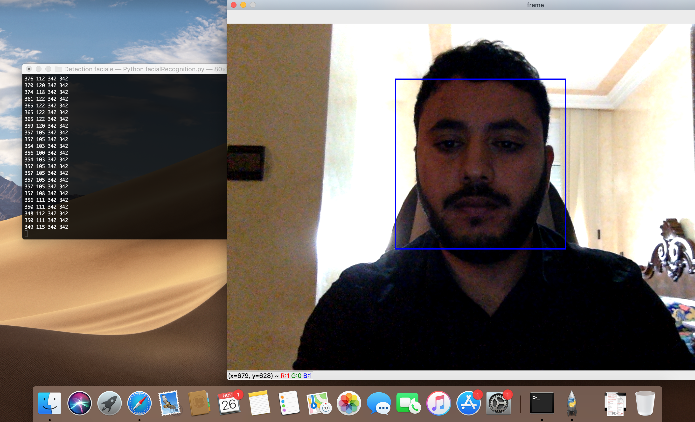

# Detection-Facial

La détection de visage est un domaine de la vision par ordinateur consistant à détecter un visage humain dans une image numérique. C'est un cas spécifique de détection d'objet, où l'on cherche à détecter la présence et la localisation précise d'un ou plusieurs visages dans une image.

